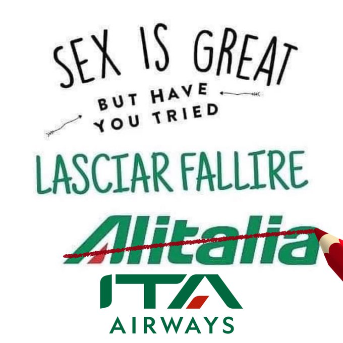
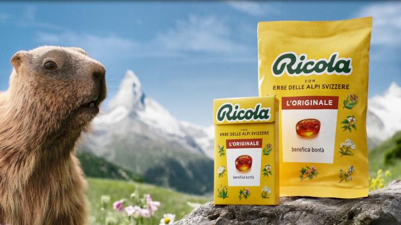

# Hello World, I'm Enrico 😁
... 🔭 this file is still Work in Progress :)

- **Nick:** enriicola
- **International Phonetic Alphabet (IPA):** `/enˈriːkola/`
- **Pronunciation:** *en-rìi-co-la*

 

There are two kinds of people in the world:
- those who can extrapolate data from missing information

 
### Hobbies:
🏋🏻‍♀️🍏🏐🤽🏻‍♂️🚵🏻‍♂️🧑🏻‍💻

<!--

&nbsp;

-->

 

